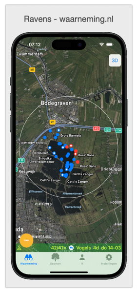
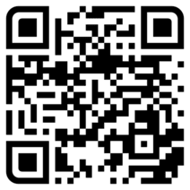

# Ravens

De **Ravens**-app stelt gebruikers in staat om **waarnemingen** zowel op een kaart als in een lijst te bekijken. Deze app haalt de meest recente informatie op van [www.waarneming.nl](https://www.waarneming.nl) en presenteert deze gegevens op een overzichtelijke manier. 

In de [Handleiding](./images/manual.md) volgt een uitleg over hoe je de app kunt gebruiken en instellen.

## Goed om te weten
- Deze app maakt gebruik van de gegevens die zijn ingevoerd door vrijwilligers op [www.waarneming.nl](https://www.waarneming.nl). 
- Deze app is compatibel met een iPhone met iOS 17. 
- Wil je optimaal gebruik maken van **Ravens** log dan in met je waarneming.nl account.

Deze app is ontworpen om het verkennen van de natuur nog leuker te maken. Als je opmerkingen hebt om de app te verbeteren, stuur dan een e-mail naar [edequartel@protonmail](mailto:edequartel@protonmail) of ga naar [gitHub Ravens](https://github.com/edequartel/Ravens). Met **Ravens** heb je snel en eenvoudig toegang tot recente waarnemingen in jouw geselecteerde gebied, van soorten en je eigen waarnemingen. Veel plezier met het ontdekken van de natuur om je heen!

## TestFlight
Gebruik de link [Ravens TestFlight](https://testflight.apple.com/join/TzVrvU1x) of scan de QR-code en je kunt de app testen via TestFlight op je iPhone. Je krijgt dan instructies over hoe je de app moet installeren.

* [Wikipedia - Ravens](https://en.wikipedia.org/wiki/Huginn_and_Muninn)
* [Website Ravens](https://edequartel.github.io/Ravens)

