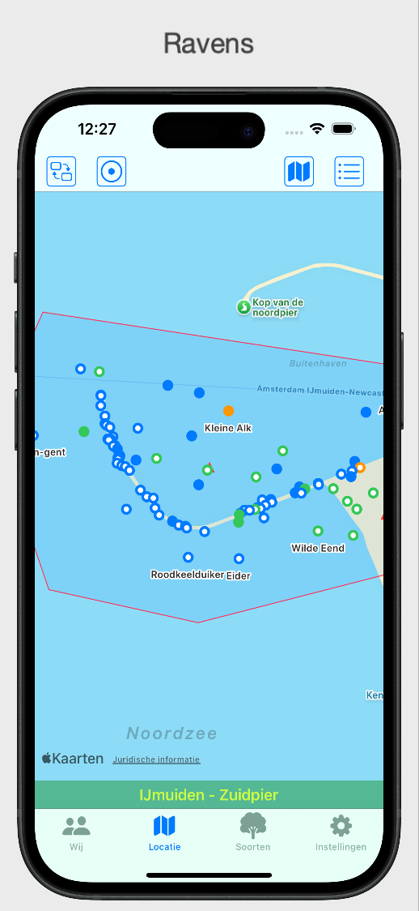

# Ravens

Volg Ravens op 

* [Instagram](https://www.instagram.com/ravensobs?igsh=MTliemQ4N2tnbDkxbA%3D%3D&utm_source=qrigsh=MTliemQ4N2tnbDkxbA%3D%3D&utm_source=qr)  
* [Blyesky](https://bsky.app/profile/ravenscorvus.bsky.social)
* [Linkedin](https://www.linkedin.com/public-profile/settings)

[English](READMEeng.MD)

De **Ravens**-app stelt gebruikers in staat om **waarnemingen** zowel op een kaart als in een lijst te bekijken. Deze app haalt de meest recente informatie op van [www.waarneming.nl](https://www.waarneming.nl) en presenteert deze gegevens op een overzichtelijke manier. 

## Appstore
Gebruik de volgende link voor Ravens in de [[Appstore](https://apps.apple.com/nl/app/ravens/id6475675260)]

## Goed om te weten
- Deze app maakt gebruik van de gegevens die zijn ingevoerd door vrijwilligers op [www.waarneming.nl](https://www.waarneming.nl). 
- Deze app is compatibel met een iPhone met iOS 17. 
- Je gebruikt **Ravens** met je waarneming.nl account.
- Ravens is toegankelijk en kan worden gebruikt met VoiceOver.

Deze app is ontworpen om het verkennen van de natuur nog leuker te maken. Met Ravens krijg je snel en eenvoudig toegang tot recente waarnemingen in jouw gekozen gebied, inclusief waarnemingen van verschillende soorten en je eigen observaties. Veel plezier met het ontdekken van de natuur om je heen!

* [Wikipedia - Ravens](https://en.wikipedia.org/wiki/Huginn_and_Muninn)
* [Website Ravens](https://www.ravensobs.com)

<!--## Koffie?

## TestFlight
Gebruik de link [Ravens TestFlight](https://testflight.apple.com/join/TzVrvU1x) of scan de QR-code en je kunt de app testen via TestFlight op je iPhone. Je krijgt dan instructies over hoe je de app moet installeren

Het ontwikkelen van de app doe ik geheel vrijwillig, iedereen kan hier gebruik van maken. Om de kosten een beetje te dekken en je beleeft plezier aan **Ravens** tracteer me dan op een [**kopje koffie**](https://www.buymeacoffee.com/4f4r4t6ytba) .

-->
