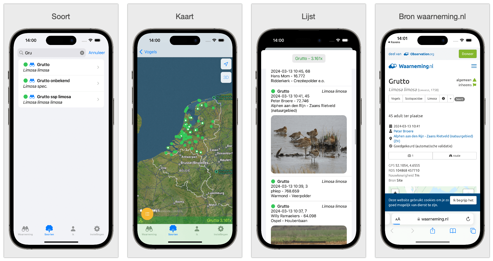

# Handleiding - Ravens

Ravens toont de waarnemingen die zijn opgelsagen op de server van waarneming.nl. Je kunt de waarnemingen zien van jezelf anderen, binenn een bepaalde straal of in een gebied. Daarnaast kun je ook van iedere soort een overzicht zien. 
Het overzicht van de waarnemingen is in een lijst of op een kaart. Voor de toegankelijkheid wordt de app altijd standaard geopend via de lijst. 

In de lijst staan de waarneminegn onder elkaar. De waarnemingen hebben kleuren naar gelang hoe zeldzaam deze soort is.

### Waarneming

Door op de waarnemingen te tappen krig je meer informatie over de waarneming. Je kunt ook swipe naar links of rechts. Naar links kun je waarneming delen, je kiest informtie over de soort of krijg je de link naar waarneming.nl, swipe je naar rechts dan kun je een lijst met geluiden van de soort krijgen, of je maakt de soort, gebied of de waarnemer favoriets wanneer je deze wilt volgen.

Onder in het scherm zie je extra informatie over het aantal, de zeldzaamheid, de soortgroep en het aantal dagen voor de ingestelde datum. Dit is allemaal in instellingen aan te passen. In de lijst staan de meest zeldzame soorten bovenaan.

### Wij
Hier komen al je waarnemingen van alle soortengroepen te staan die je hebt ingevoerd. (Je kunt hier onder in door bladeren). 

### Straal
Hier zie je een lijst van de soorten van de soortengroep die is gekozen in instellingen. Door een seconde lang je vinger op een soort de drukken kun je de soort een bookmark geven of weghalen. Links boven kun je aangeven of je de bookmarks wilt zien. Het icoon voor persoon geeft aan of je bent aangemeld bij waarneming.nl

### Locatie

Hier zie je een lijst van de soorten van de soortengroep die is gekozen in instellingen. Door een seconde lang je vinger op een soort de drukken kun je de soort een bookmark geven of weghalen. Links boven kun je aangeven of je de bookmarks wilt zien. Het icoon voor persoon geeft aan of je bent aangemeld bij waarneming.nl

### Soorten

Hier zie je een lijst van de soorten van de soortengroep die is gekozen in instellingen. Door een seconde lang je vinger op een soort de drukken kun je de soort een bookmark geven of weghalen. Links boven kun je aangeven of je de bookmarks wilt zien. Het icoon voor persoon geeft aan of je bent aangemeld bij waarneming.nl

Door een soort aan te tikken krijg je de waarnemingen van deze soort. Wanneer er foto's (in de toekomst audio) beschikbaar is kun je deze inzien.

### Instellingen

Bij login kun je inloggen op observation.org/waarneming.nl. Wanneer je observation.org of waarneming.nl selecteert bepaal je over welk gebied de waarnemingen zich strekken.
Kies de datum waarvan je de waarnemingen wilt zien. Het aantal dagen geeft de dagen vóór de geselecteerde datum aan. Op een kaart worden de meest zeldzame soorten met kleuren aangegeven (groen: algemeen, blauw: minder algemeen, oranje: zeldzaam, rood: zeer zeldzaam). 

### Limiet van waarnemingen
- Om het overzichtelijk te houden, toont de app niet meer dan 100 waarnemingen. (In een latere versie kan je door de waarnemingen bladeren)
- Als er meer dan 100 waarnemingen zijn in het geselecteerde gebied, overweeg dan de straal en het aantal dagen te verkleinen.

