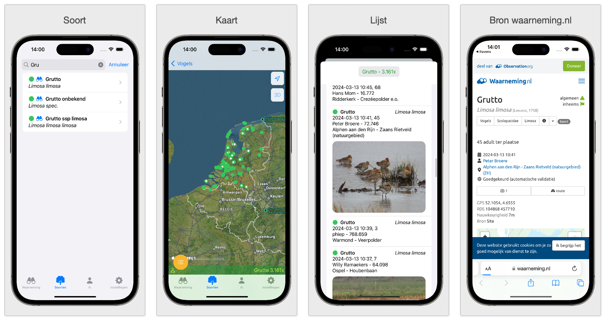

# Handleiding - Ravens

* [https://edequartel.github.io/Ravens/manual.html](https://edequartel.github.io/Ravens/manual.html)
* [Handleiding in PDF](./images/manual.pdf)

### Waarneming

Bij het openen van Ravens zie je de kaart van Nederland. Door op een locatie te tikken zie je een cirkel met daarin de laatste waargenomen soorten in dat gebied. De soortengroep kun je aangeven in instellingen. De waarnemingen hebben kleuren. Deze laat de zeldzaamheid zien. Een ring om de waarneming geeft aan dat er geluidsopname bij hoort en een stip een foto. 

Onder in het scherm zie je extra informatie over het aantal, de zeldzaamheid, de soortgroep en het aantal dagen voor de ingestelde datum. Dit is allemaal in instellingen aan te passen. In de lijst staan de meest zeldzame soorten bovenaan.

### Soorten

Hier zie je een lijst van de soorten van de soortengroep die is gekozen in instellingen. Door een seconde lang je vinger op een soort de drukken kun je de soort een bookmark geven of weghalen. Links boven kun je aangeven of je de bookmarks wilt zien. Het icoon voor persoon geeft aan of je bent aangemeld bij waarneming.nl

Door een soort aan te tikken krijg je de waarnemingen van deze soort. Wanneer er foto's (in de toekomst audio) beschikbaar is kun je deze inzien.

### Ik

Hier komen al je waarnemingen van alle soortengroepen te staan die je hebt ingevoerd. (Je kunt hier onder in door bladeren). 

### Instellingen

Bij login kun je inloggen op observation.org/waarneming.nl. Wanneer je observation.org of waarneming.nl selecteert bepaal je over welk gebied de waarnemingen zich strekken.
Kies de datum waarvan je de waarnemingen wilt zien. Het aantal dagen geeft de dagen vóór de geselecteerde datum aan. Op een kaart worden de meest zeldzame soorten met kleuren aangegeven (groen: algemeen, blauw: minder algemeen, oranje: zeldzaam, rood: zeer zeldzaam). 

### Limiet van waarnemingen
- Om het overzichtelijk te houden, toont de app niet meer dan 100 waarnemingen. (In een latere versie kan je door de waarnemingen bladeren)
- Als er meer dan 100 waarnemingen zijn in het geselecteerde gebied, overweeg dan de straal en het aantal dagen te verkleinen.

