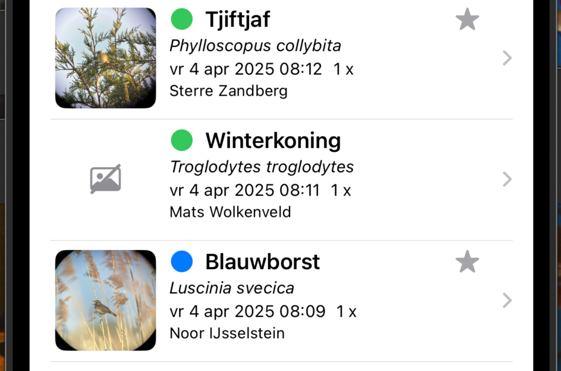
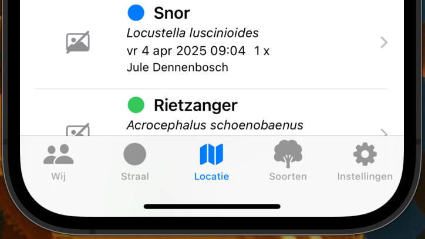
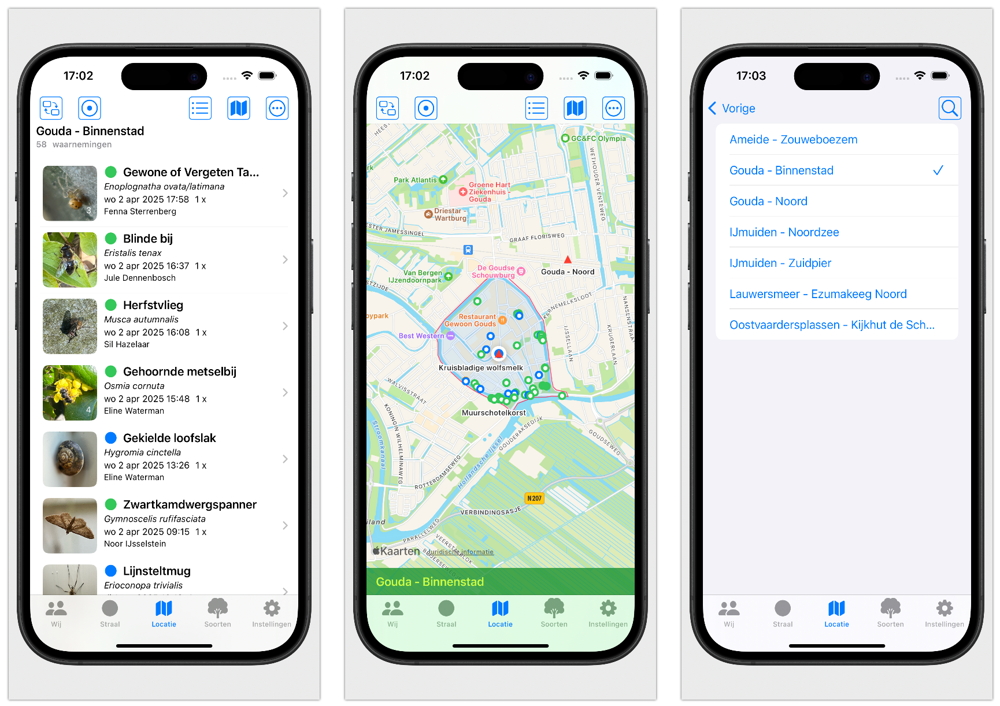
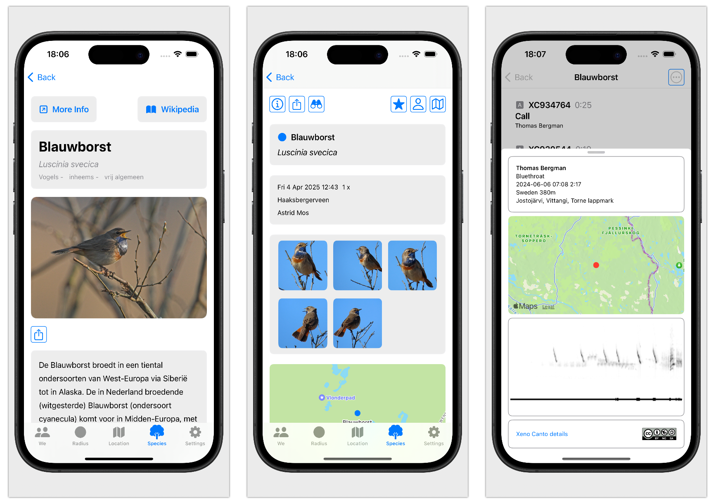

# Handleiding - Ravens

Welkom bij de handleiding van **Ravens**.  
Met deze app bekijk je eenvoudig waarnemingen van [waarneming.nl](https://waarneming.nl).

Bij het openen van Ravens zie je een scherm met waarnemingen, verdeeld over verschillende tabbladen. De tabbladen zijn: **Wij (Ik)**, **Straal**, **Locatie**, **Soort** en **Instellingen**.

In deze handleiding worden de onderdelen stap voor stap uitgelegd zodat je makkelijk met de app kunt werken.

---

## Knoppen

Bovenaan het scherm vind je een aantal knoppen. Van links naar rechts:

- Wissel tussen lijstweergave en kaartweergave  
- Activeer de huidige locatie  
- Bekijk een lijst met waarnemers die je volgt  
- Favoriete gebied (volledig gevuld als het gebied is gemarkeerd als favoriet)  
- Menu met sorteer- en filteropties  

---

## Waarneming

De kern van waarneming.nl zijn natuurlijk de **waarnemingen**.  
Elke waarneming is zichtbaar in een lijst of op de kaart. Tik op een waarneming voor meer informatie.

### Naar rechts vegen

Als je een waarneming naar rechts veegt, verschijnen de volgende knoppen:

- Geluidenlijst van de soort  
- Waarnemer als favoriet instellen  
- Soort als favoriet instellen  

### Naar links vegen

Als je naar links veegt, zie je deze knoppen:

- Deel de waarneming  
- Meer informatie over de waarneming  
- Link naar de waarneming op waarneming.nl  

---

## Tabs

Onderaan het scherm zie je de tabbladen:

- **Wij** – waarnemingen per waarnemer  
- **Straal** – waarnemingen binnen een ingestelde straal  
- **Locatie** – waarnemingen op een geselecteerde locatie  
- **Soorten** – waarnemingen per soort  
- **Instellingen** – o.a. taal en inlogmogelijkheden  

---

### Wij

Hier vind je jouw eigen waarnemingen.  
Bovenin kun je kiezen uit een lijst van favoriete waarnemers.  
Veeg naar links om de QR-code van een waarnemer te bekijken.  
Je kunt de lijst filteren en sorteren, bijvoorbeeld op aantal dagen.  
Met de knop linksboven wissel je tussen lijst en kaart.

---

### Straal

Hier zie je alle waarnemingen binnen een ingestelde straal.  
Gebruik de knop rechtsboven om je huidige locatie te gebruiken.  
Je kunt ook een positie op de kaart kiezen – de lijst wordt automatisch ververst.

---

### Locatie

Zoals bij 'Straal', maar hier kun je ook je favoriete locaties selecteren of zoeken.  
Kies een locatie uit de lijst om de bijbehorende waarnemingen te zien.

---

### Soorten

Bekijk hier een lijst van soorten binnen een geselecteerde soortgroep.  
Maak een soort favoriet (er verschijnt dan een ster).  
Gebruik de ster-knop linksboven om alleen favoriete soorten te tonen.  
Je kunt ook zoeken op naam en filteren om minder waarnemingen te zien.
Tik op een soort om de waarnemingen van die soort te bekijken.  

---

### Audio

Bij soortgroepen zoals vogels, zoogdieren, krekels en sprinkhanen kun je ook geluidsopnames beluisteren.  
Deze opnames komen van Xeno-Canto en zijn van hoge kwaliteit.  
Tik op een opname om deze te starten of te stoppen.  
Filter op type geluid.

---

### Informatie

Bij elke soort, waarneming of audio is aanvullende informatie beschikbaar.

---

### Instellingen

Hier kun je de hoofdtaal en tweede taal van de app instellen.  
Handig als je in het buitenland bent.

Via het inlogscherm kun je inloggen op observation.org of waarneming.nl.  

Je vind hier jouw QR-code waarmee een ander jou aan de app kan toevoegen en gelijk favoriet maakt.

