# Manual - Ravens

Welcome to the **Ravens** manual.  
With this app, you can easily view observations from [waarneming.nl](https://waarneming.nl).

When you open Ravens, you’ll see a screen with observations, divided across several tabs. The tabs are: **We (Me)**, **Radius**, **Location**, **Species**, and **Settings**.  
This manual explains each part of the app step by step so you can easily get started.

---

## Buttons

At the top of the screen, you’ll find several buttons. From left to right:

- Switch between list and map view  
- Activate current location  
- View a list of observers you follow  
- Favorite area button (fully filled if marked as favorite)  
- Menu with sort and filter options  

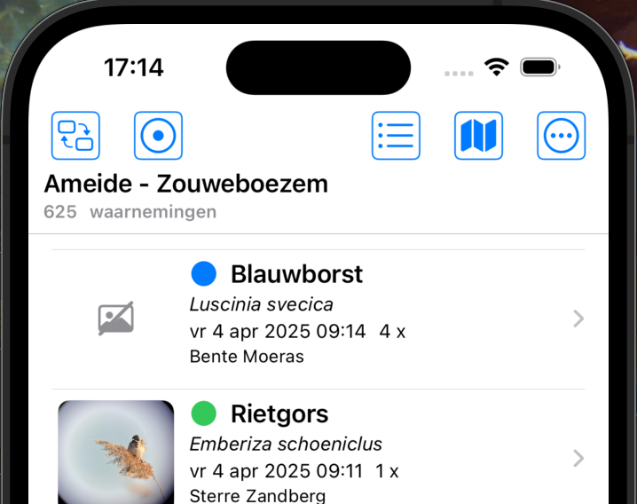

---

## Observation

The core of waarneming.nl is, of course, the **observation**.  
Each observation is visible in a list or on the map. Tap an observation for more details.

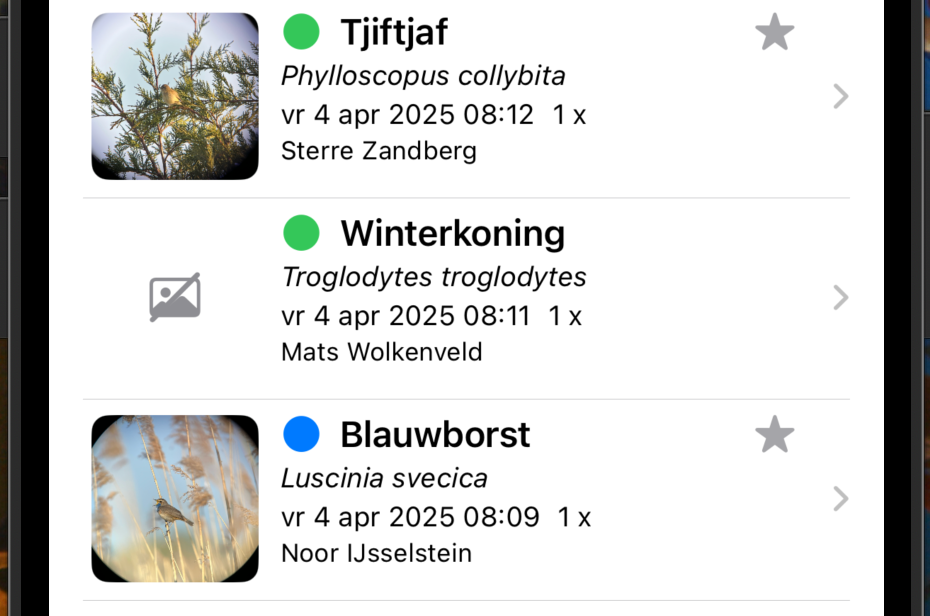

### Swipe Right

When swiping an observation to the right, you’ll see these buttons:

- Sound list of the species  
- Mark observer as favorite  
- Mark species as favorite  

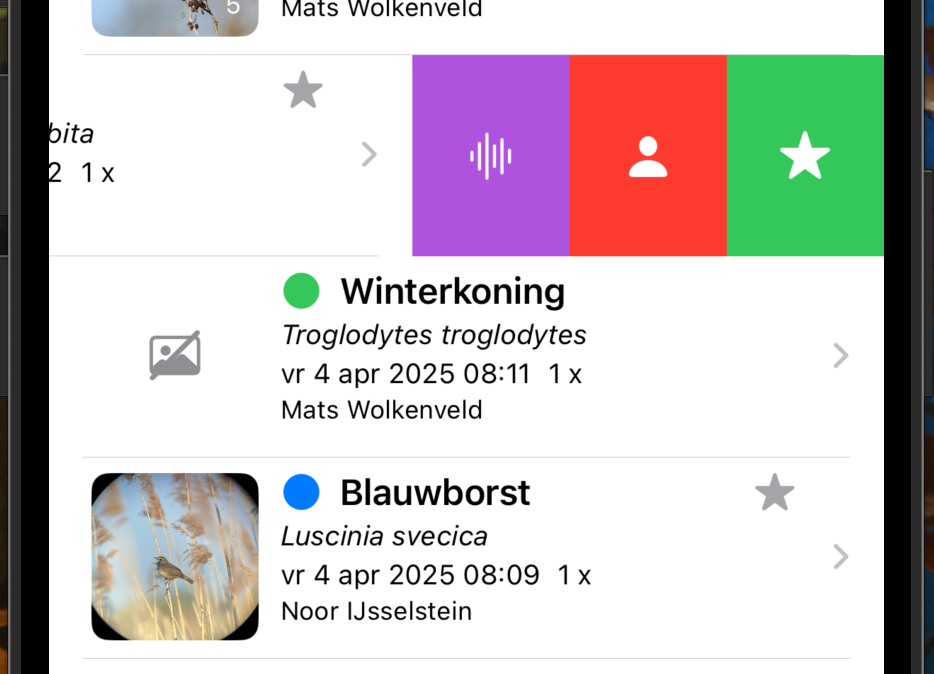

### Swipe Left

When swiping left, the following options appear:

- Share the observation  
- More information about the observation  
- Link to the observation on waarneming.nl  

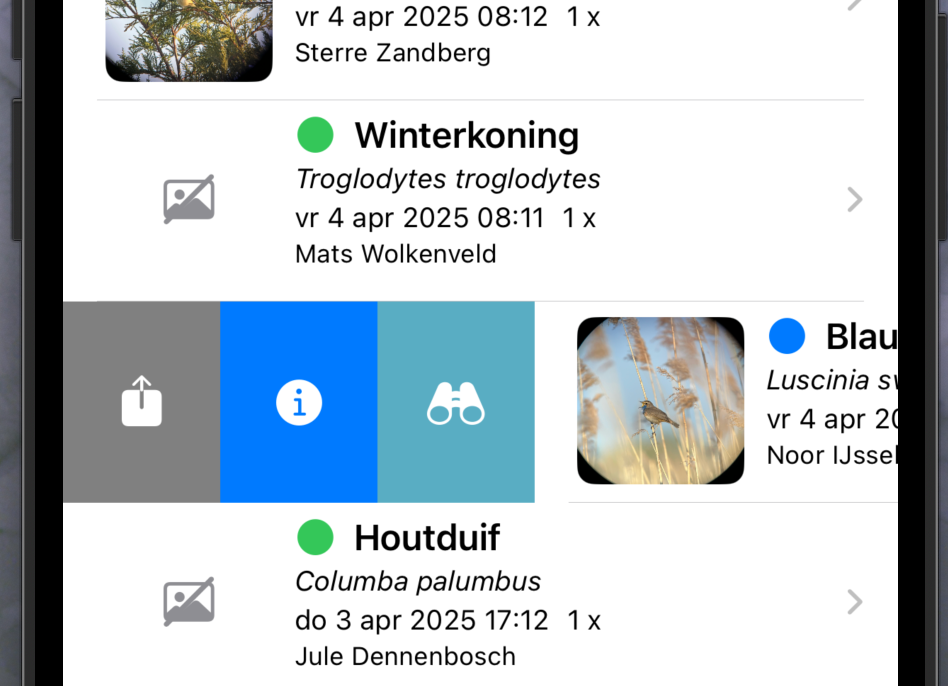

---

## Tabs

At the bottom of the screen, you'll see the tabs:

- **We** – observations per observer  
- **Radius** – observations within a selected radius  
- **Location** – observations at a selected location  
- **Species** – observations by species  
- **Settings** – language and login options  

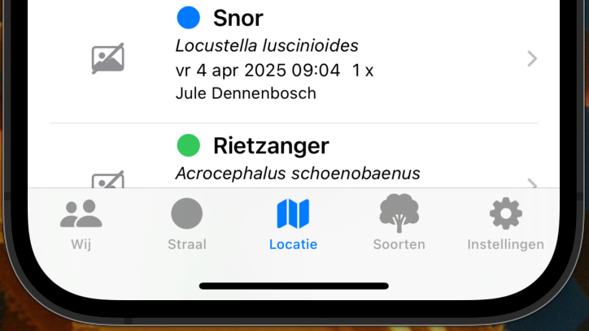

---

### We

This section shows your personal observations.  
At the top, you can select a favorite observer from a list.  
Swipe left to see the QR code of that observer.  
You can filter and sort the list, e.g. by number of days.  
Use the button in the top left to switch between list and map view.

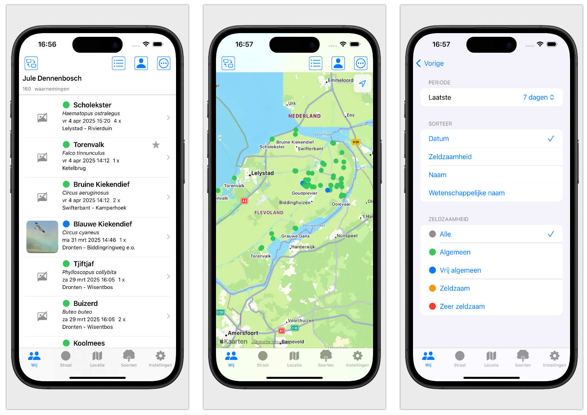

---

### Radius

Here you see all observations within a certain radius.  
Use the button in the top right to activate your current location.  
You can also tap on the map to set a position – the list refreshes automatically.

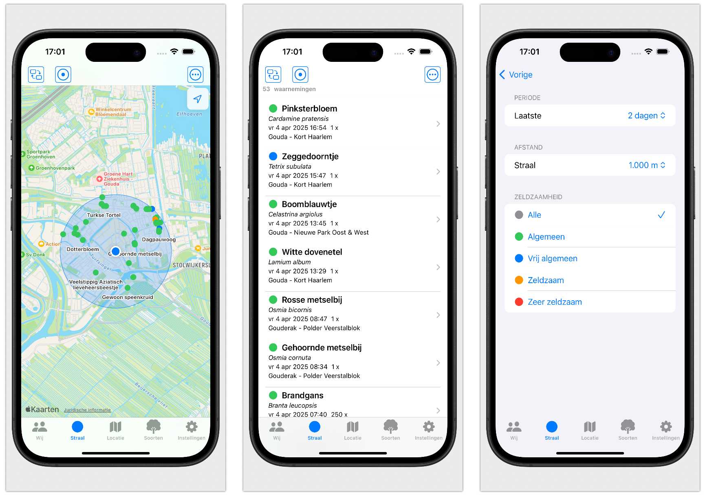

---

### Location

Similar to the ‘Radius’ tab, but here you can also select or search your favorite locations.  
Choose a location from the list to view the corresponding observations.

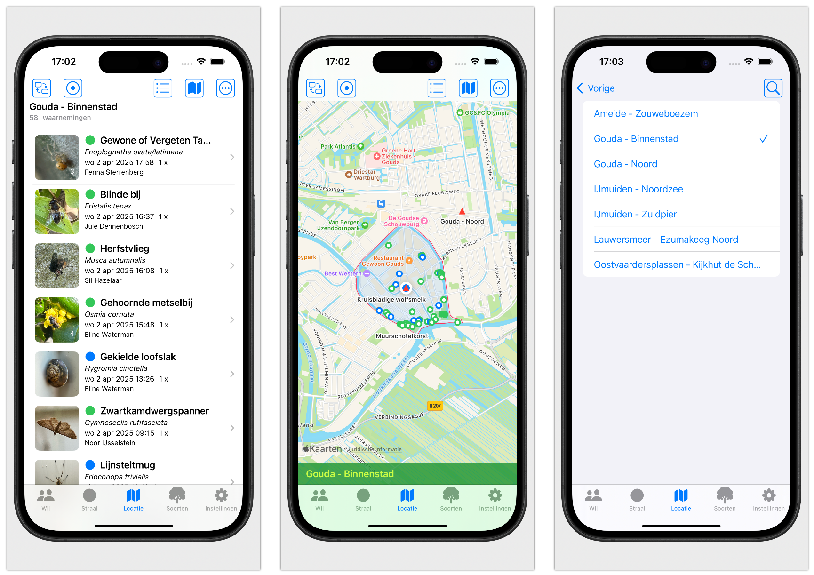

---

### Species

This shows a list of species from a selected species group.  
You can mark a species as favorite (a star appears).  
Use the star button in the top left to show only favorite species.  
You can search by name and filter the list to reduce the number of observations shown.

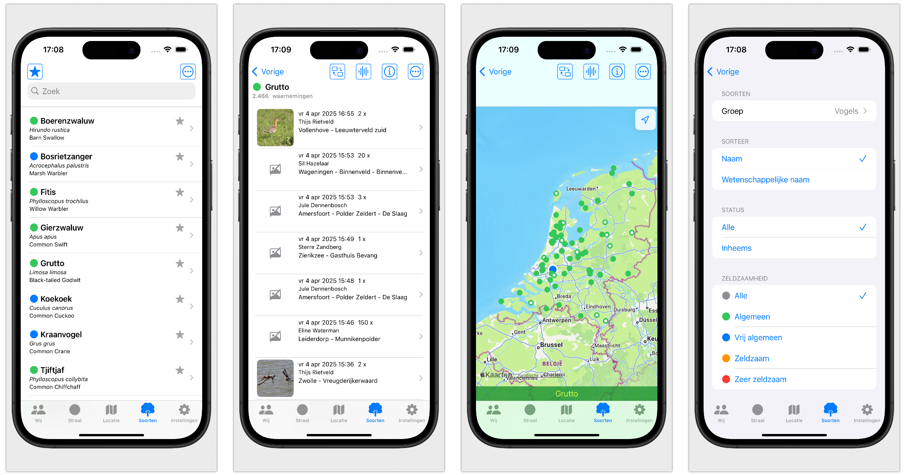

Tap on a species to view its observations.  
If available, you’ll see photos (and in the future, audio recordings).

---

### Audio

For certain groups like birds, mammals, crickets, and grasshoppers, you can listen to sound recordings.  
These recordings come from Xeno-Canto and are high quality.  
Tap a recording to start or stop it.  
You can filter the list by sound type.

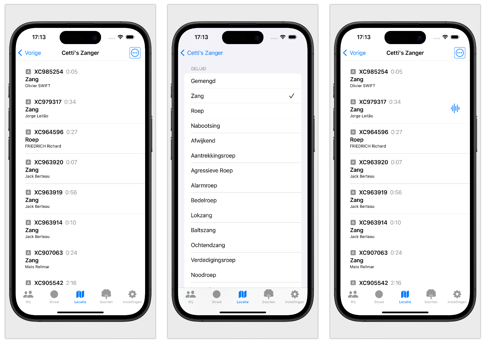

---

### Information

More detailed information is available for each species, observation, or audio recording.

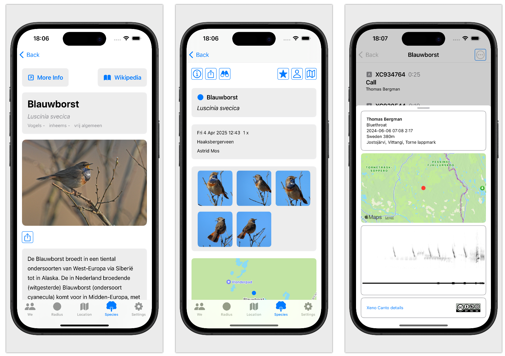

---

### Settings

Here you can set the main language and secondary language of the app.  
Useful when you're in a country where people don't speak Dutch.

You can log in to observation.org or waarneming.nl.  
Your selection determines which region’s observations are shown.

You’ll also find a QR code here, which others can scan to add you as a favorite observer.

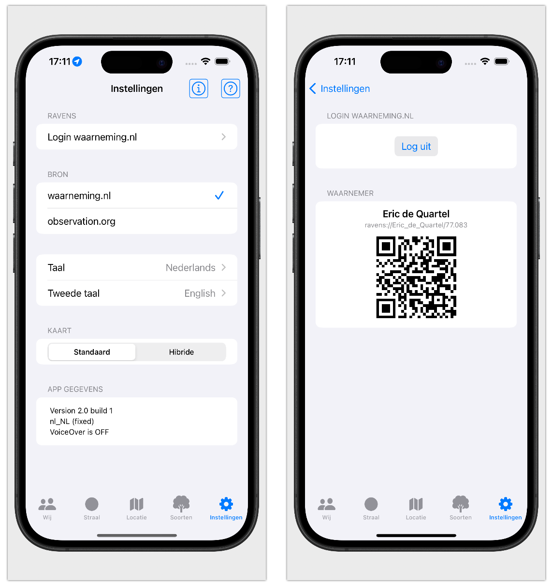